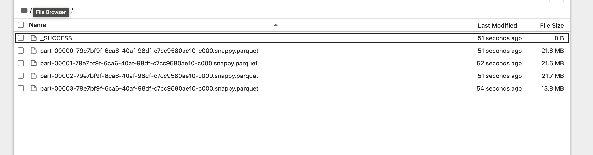
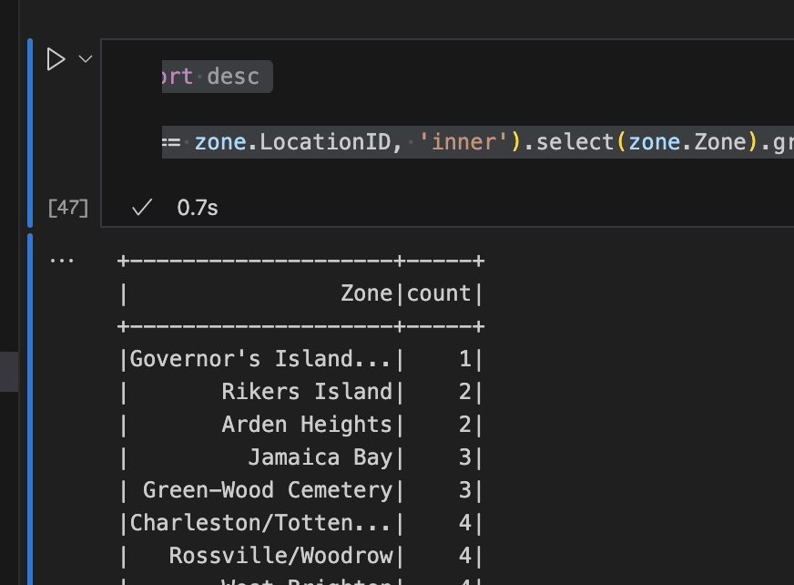

## Question 1

3.5.5

## Question 2

25 MB

## Question 3

spark.sql("""
    select count(1) from trip_data where
        tpep_pickup_datetime >= '2024-10-15 00:00:00' and tpep_pickup_datetime < '2024-10-16 00:00:00' and
        tpep_dropoff_datetime >= '2024-10-15 00:00:00' and tpep_dropoff_datetime < '2024-10-16 00:00:00'
""").show()

125,567

## Question 4

spark.sql("""
    select DATEDIFF(hour, tpep_pickup_datetime, tpep_dropoff_datetime) as difference from trip_data order by difference desc
""").show()

162

## Question 5

4040

## Question 6

|Governor's Island...|    1|